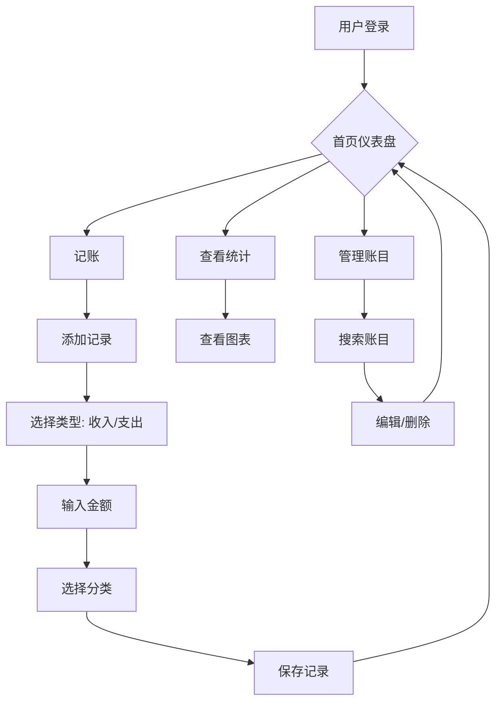

# 智能记账工具 PRD

## 1. 产品概述

一款简洁优雅的个人记账工具，帮助用户轻松记录日常收支、追踪消费习惯、合理管理财务。

解决个人财务管理混乱、难以追踪支出、无法直观了解财务状况等痛点。目标用户为需要简单记账管理个人财务的个人用户。

## 2. 核心功能

### 2.1 用户角色

| 角色 | 注册方式 | 核心权限 |
|------|----------|----------|
| 普通用户 | 手机号/邮箱注册 | 记录收支、查看统计、导出数据 |

### 2.2 功能模块

1. **首页仪表盘**：展示本月收支概况、余额、近期交易记录
2. **记账页面**：快速添加收入/支出记录，支持分类管理
3. **统计页面**：可视化图表展示收支趋势、分类占比
4. **账目管理**：查看、编辑、删除历史记录，支持搜索筛选
5. **个人中心**：设置预算、导出数据、修改个人信息

## 3. 核心流程

### 3.1 主要用户流程

```
用户注册 → 首次设置预算 → 开始记账 → 查看统计 → 调整预算
```

### 3.2 记账流程

```
打开记账页 → 选择收支类型 → 输入金额 → 选择分类 → 添加备注(可选) → 保存
```

### 3.3 流程图



## 4. 用户界面设计

### 4.1 设计风格

**风格定位**：极简现代 + 金融科技感

**色彩方案**：
- 主色：深蓝 `#1a237e`（信任、专业）
- 收入：翡翠绿 `#00c853`
- 支出：珊瑚红 `#ff5252`
- 背景：渐变灰白 `#fafafa` → `#f5f5f5`
- 强调：金色 `#ffd54f`

**字体**：
- 标题：思源黑体（Noto Sans SC）Bold
- 正文：思源黑体（Noto Sans SC）Regular
- 数字：Roboto Mono（等宽，便于金额对齐）

**按钮风格**：圆角矩形、微妙阴影、hover 渐变效果

**布局风格**：卡片式布局、顶部导航、底部快捷操作栏

**图标风格**：线性图标、简约不失辨识度

### 4.2 页面设计概览

| 页面名称 | 模块名称 | UI 元素 |
|---------|----------|---------|
| 首页仪表盘 | 本月收支卡片 | 渐变背景、数字大字体、微动效 |
| 首页仪表盘 | 近期交易列表 | 卡片列表、左图标右金额、分类标签 |
| 记账页 | 快速记账表单 | 滑动选择器、大号数字键盘、分类网格 |
| 统计页 | 收支趋势图 | 折线图/柱状图切换、日期筛选器 |
| 统计页 | 分类占比图 | 环形图/饼图、颜色编码图例 |
| 管理页 | 账目搜索 | 搜索框、筛选器（日期、分类、类型） |
| 管理页 | 账目列表 | 可滑动删除、点击编辑详情弹窗 |

### 4.3 响应式设计

采用移动优先设计，确保在手机、平板、桌面端均有良好体验。

**关键适配点**：
- 移动端：单列布局，底部固定快捷操作栏
- 平板端：双栏布局，左侧导航右侧内容
- 桌面端：居中容器最大宽度 1200px，多栏布局

### 4.4 微交互设计

- 记账成功：金额数字弹跳动画 + 成功提示
- 删除记录：左滑显示删除按钮，确认对话框
- 切换页面：平滑过渡动画
- 数字键盘：按下态反馈

## 5. 技术架构

详见技术架构文档。

## 6. 数据模型

### 6.1 核心数据实体

| 实体 | 字段 | 说明 |
|------|------|------|
| 用户 | id, username, password, email, created_at | 用户基本信息 |
| 账目记录 | id, user_id, type, amount, category, note, created_at | 收支记录 |
| 分类 | id, name, icon, type, user_id | 自定义分类 |
| 预算 | id, user_id, month, budget | 月度预算 |

### 6.2 预设分类

**支出分类**：餐饮🍜、交通🚗、购物🛒、娱乐🎮、居住🏠、医疗💊、教育📚、通讯📱、其他📌

**收入分类**：工资💰、奖金🎁、投资📈、兼职💼、其他📌

## 7. 产品亮点

1. **极简操作**：3秒完成一笔记账，数字键盘直接输入
2. **直观统计**：一键查看本月收支趋势、分类占比
3. **预算提醒**：设置月度预算，超支时智能提醒
4. **数据安全**：本地存储 + 云端同步双保险
5. **优雅体验**：流畅动画、精心设计的视觉反馈
