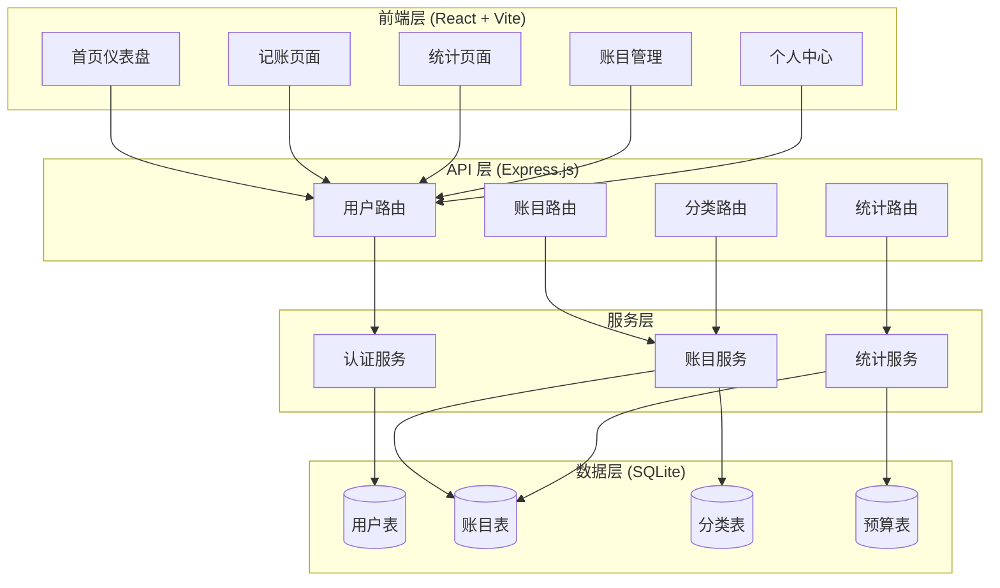
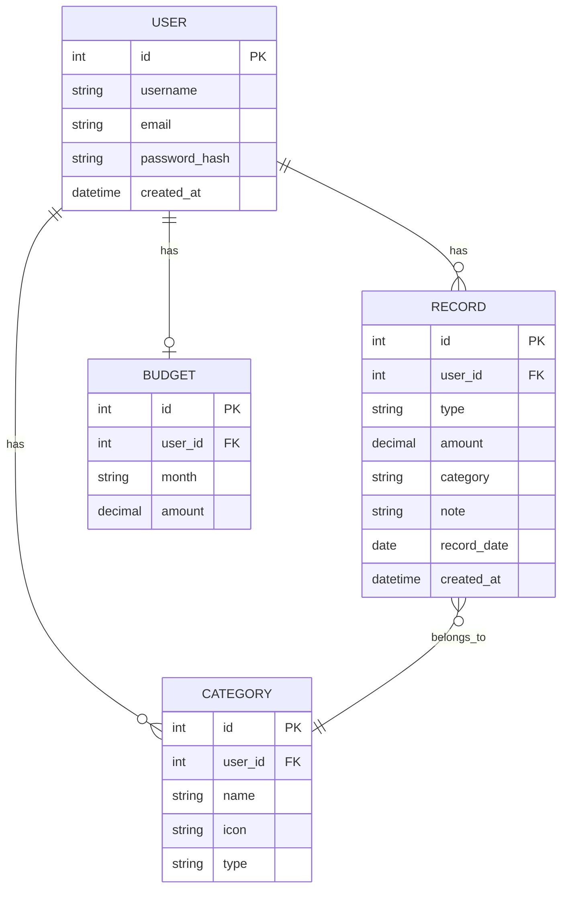

# 智能记账工具 - 技术架构文档

## 1. 架构设计

### 1.1 系统架构图



## 2. 技术栈

### 2.1 前端技术

- **框架**：React 18 + Vite
- **样式**：Tailwind CSS 3
- **路由**：React Router 6
- **状态管理**：React Context API
- **图表**：Chart.js + react-chartjs-2
- **图标**：Lucide React
- **HTTP 客户端**：Fetch API

### 2.2 后端技术

- **运行时**：Node.js 18+
- **框架**：Express.js 4
- **数据库**：SQLite 3 (轻量级文件数据库)
- **ORM**：better-sqlite3 (同步 API，性能优异)
- **认证**：JWT (JSON Web Token)
- **密码加密**：bcryptjs

### 2.3 开发工具

- **包管理**：npm
- **构建工具**：Vite
- **开发服务器**：concurrently (前后端并行启动)

## 3. 路由定义

### 3.1 前端路由

| 路由 | 页面 | 功能描述 |
|------|------|----------|
| `/` | 首页仪表盘 | 展示收支概况、近期交易 |
| `/add` | 记账页面 | 添加新的收支记录 |
| `/stats` | 统计页面 | 查看收支统计图表 |
| `/records` | 账目管理 | 管理历史记录、搜索筛选 |
| `/settings` | 个人中心 | 设置预算、导出数据 |

### 3.2 后端 API

| 方法 | 路由 | 功能 |
|------|------|------|
| POST | `/api/auth/register` | 用户注册 |
| POST | `/api/auth/login` | 用户登录 |
| GET | `/api/auth/me` | 获取当前用户信息 |
| GET | `/api/records` | 获取账目列表 |
| POST | `/api/records` | 添加账目记录 |
| PUT | `/api/records/:id` | 更新账目记录 |
| DELETE | `/api/records/:id` | 删除账目记录 |
| GET | `/api/stats/summary` | 获取收支汇总 |
| GET | `/api/stats/trend` | 获取趋势数据 |
| GET | `/api/categories` | 获取分类列表 |
| GET | `/api/budget` | 获取预算 |
| PUT | `/api/budget` | 设置预算 |

## 4. API 详细定义

### 4.1 认证接口

**POST /api/auth/register**
```json
请求:
{
  "username": "string",
  "email": "string",
  "password": "string"
}

响应:
{
  "success": true,
  "token": "jwt_token",
  "user": { "id": 1, "username": "xxx", "email": "xxx" }
}
```

**POST /api/auth/login**
```json
请求:
{
  "email": "string",
  "password": "string"
}

响应:
{
  "success": true,
  "token": "jwt_token",
  "user": { "id": 1, "username": "xxx", "email": "xxx" }
}
```

### 4.2 账目接口

**POST /api/records**
```json
请求:
{
  "type": "income | expense",
  "amount": 100.00,
  "category": "餐饮",
  "note": "午餐",
  "date": "2024-01-15"
}

响应:
{
  "success": true,
  "record": { "id": 1, ... }
}
```

**GET /api/records**
```json
查询参数: ?month=2024-01&type=expense&category=餐饮&search=午餐

响应:
{
  "success": true,
  "records": [...],
  "total": 100
}
```

### 4.3 统计接口

**GET /api/stats/summary**
```json
响应:
{
  "success": true,
  "month": "2024-01",
  "income": 5000,
  "expense": 3000,
  "balance": 2000,
  "budget": 4000,
  "budgetUsed": 75
}
```

**GET /api/stats/trend**
```json
响应:
{
  "success": true,
  "trend": [
    { "date": "2024-01-01", "income": 100, "expense": 50 },
    ...
  ],
  "byCategory": [
    { "category": "餐饮", "total": 500, "percentage": 25 },
    ...
  ]
}
```

## 5. 数据模型

### 5.1 ER 图



### 5.2 数据定义语言 (DDL)

```sql
CREATE TABLE users (
  id INTEGER PRIMARY KEY AUTOINCREMENT,
  username VARCHAR(50) NOT NULL,
  email VARCHAR(100) UNIQUE NOT NULL,
  password_hash VARCHAR(255) NOT NULL,
  created_at DATETIME DEFAULT CURRENT_TIMESTAMP
);

CREATE TABLE records (
  id INTEGER PRIMARY KEY AUTOINCREMENT,
  user_id INTEGER NOT NULL,
  type VARCHAR(10) NOT NULL CHECK(type IN ('income', 'expense')),
  amount DECIMAL(10, 2) NOT NULL,
  category VARCHAR(50) NOT NULL,
  note TEXT,
  record_date DATE NOT NULL,
  created_at DATETIME DEFAULT CURRENT_TIMESTAMP,
  FOREIGN KEY (user_id) REFERENCES users(id) ON DELETE CASCADE
);

CREATE TABLE categories (
  id INTEGER PRIMARY KEY AUTOINCREMENT,
  user_id INTEGER NOT NULL,
  name VARCHAR(50) NOT NULL,
  icon VARCHAR(10),
  type VARCHAR(10) NOT NULL CHECK(type IN ('income', 'expense')),
  FOREIGN KEY (user_id) REFERENCES users(id) ON DELETE CASCADE
);

CREATE TABLE budgets (
  id INTEGER PRIMARY KEY AUTOINCREMENT,
  user_id INTEGER NOT NULL,
  month VARCHAR(7) NOT NULL,
  amount DECIMAL(10, 2) NOT NULL,
  UNIQUE(user_id, month),
  FOREIGN KEY (user_id) REFERENCES users(id) ON DELETE CASCADE
);

CREATE INDEX idx_records_user_id ON records(user_id);
CREATE INDEX idx_records_record_date ON records(record_date);
CREATE INDEX idx_records_type ON records(type);
```

## 6. 项目结构

```
accounting-app/
├── package.json
├── vite.config.js
├── tailwind.config.js
├── postcss.config.js
├── index.html
├── server/
│   ├── index.js              # Express 服务器入口
│   ├── database/
│   │   ├── connection.js     # SQLite 连接
│   │   └── schema.js         # 数据库初始化
│   ├── routes/
│   │   ├── auth.js           # 认证路由
│   │   ├── records.js        # 账目路由
│   │   ├── stats.js          # 统计路由
│   │   └── categories.js     # 分类路由
│   ├── middleware/
│   │   └── auth.js           # JWT 认证中间件
│   └── services/
│       ├── authService.js
│       ├── recordService.js
│       └── statsService.js
├── src/
│   ├── main.jsx              # React 入口
│   ├── App.jsx               # 主应用组件
│   ├── index.css             # 全局样式
│   ├── context/
│   │   └── AuthContext.jsx   # 认证上下文
│   ├── components/
│   │   ├── Layout.jsx        # 布局组件
│   │   ├── RecordCard.jsx    # 记录卡片
│   │   ├── StatsChart.jsx    # 统计图表
│   │   └── ...
│   └── pages/
│       ├── Dashboard.jsx     # 首页
│       ├── AddRecord.jsx     # 记账页
│       ├── Stats.jsx         # 统计页
│       ├── Records.jsx        # 账目管理
│       └── Settings.jsx      # 设置页
└── data/
    └── accounting.db         # SQLite 数据库文件
```

## 7. 安全性设计

### 7.1 认证与授权

- 使用 JWT 进行用户身份验证
- Token 有效期 7 天，自动续期
- 密码使用 bcrypt 加密存储
- 所有 API 请求需要携带有效 Token

### 7.2 数据安全

- 用户只能访问自己的数据（user_id 隔离）
- SQL 参数化查询防止注入攻击
- 敏感操作（如删除）需要确认

### 7.3 输入验证

- 金额必须为正数
- 日期格式验证
- 文本输入长度限制
- XSS 防护

## 8. 性能优化

### 8.1 前端优化

- React 组件懒加载
- 图表按需渲染
- 本地缓存常用数据
- 乐观 UI 更新

### 8.2 后端优化

- SQLite 索引优化查询
- 分页查询避免全表扫描
- 连接池复用数据库连接

## 9. 部署架构

采用前后端分离架构：

- **前端**：构建为静态文件，由 Express 提供服务
- **后端**：Express API 服务
- **数据库**：SQLite 文件数据库，适合中小型应用

开发环境使用 `concurrently` 并行启动前后端。
